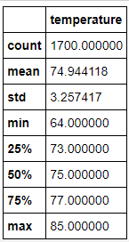
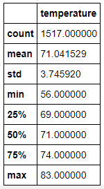

# surfs_up

## Overview of the statistical analysis:
To confirm if investing in a surf and ice cream shop in Oahu is worth the investment. By looking at the weather data from the month of June and December of the past few years, we can determine if the weather allows for both year round surf and year round ice cream.

## Results:

### Temperature Data in June             
 
### Temperature Data in December

Based on the quick view of the temperature results between June and December. There are minor differences between the two.

- The average temperature in June is around 74.9 degrees while December's average temperature is 71.0 degrees. This means that it is still quite warm in the new season and ice cream can be a viable treat for tourists and guests at the beach.

- It does seem like the lowest temperature in June (64 degrees) is much higher than the lowest temperature in December(56 degrees). It can mean that the ice cream business may not run as profitable in the latter end of the year.

- Lastly, we can see that it is generally warmer in June by comparing the 25th, 50th and 75th percentiles of temperatures. In all three percentiles, the month of June is on average, 3 to 4 degrees warmer.

## Summary:

While temperature is a good indication if the ice cream sales will be profitable during the summer and winter months. It doesn't affect the surfing part of our plan. Yes, Oahu seem to stay warm throughout the year, therefore people will go to the beach and surf. However, the popularity of surfing may best be determined by precipitation. We were informed the previous investment failed due to intolerable amount of rain.
We can run an additional query for precipitation to confirm how much rain Oahu receives in the months of June and December.

The second query we can look into is picking out the station. Since the file gave us data for measurement (temperature & precipitation) and station, we can use the location of where the data came from as a second query. We can query which station had the most valuable data and choose a shop location closest to the area.
